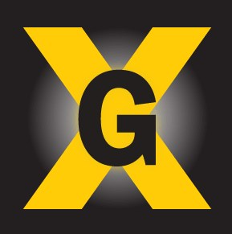
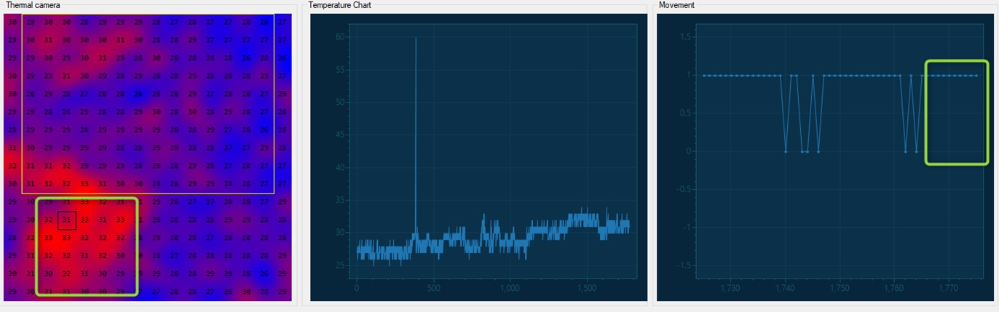
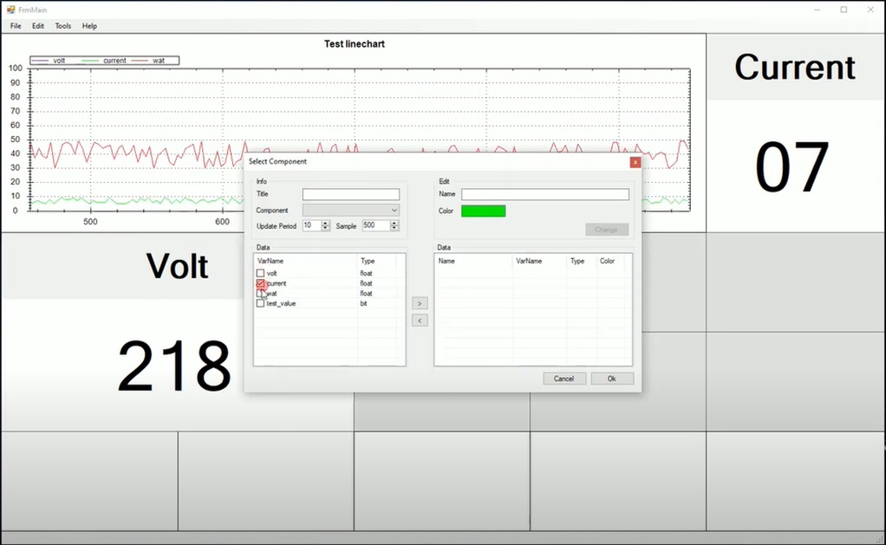
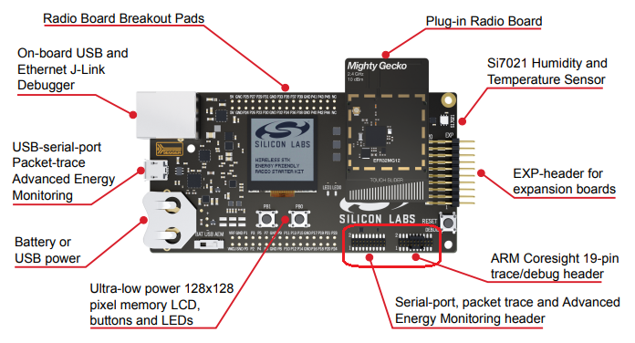
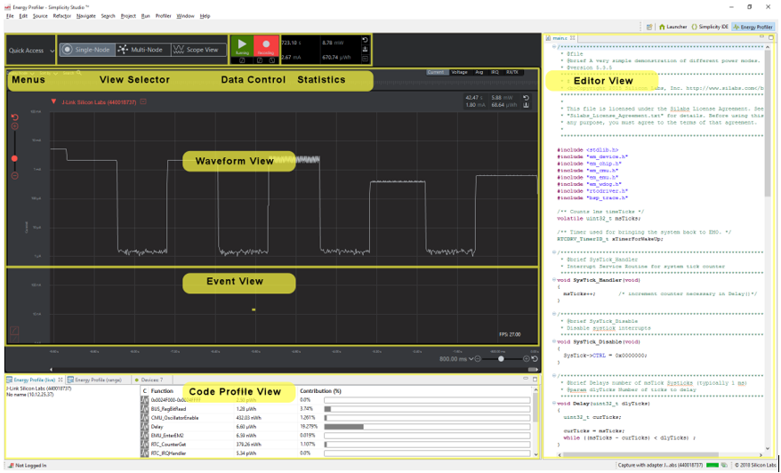
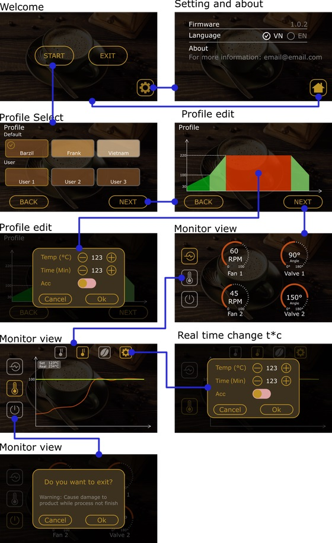
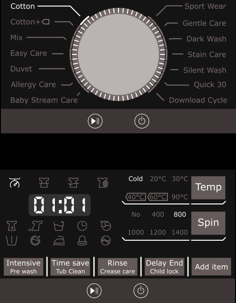
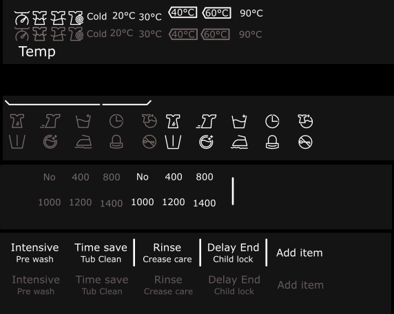
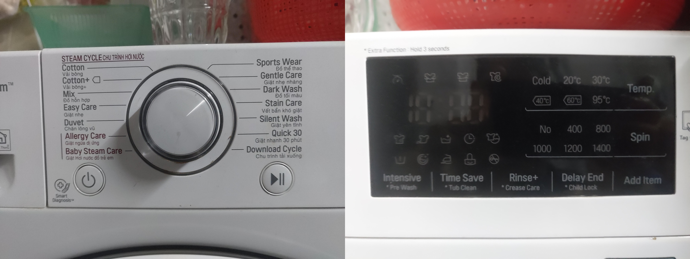

# Introduction

Hello!

My name is Hiep, I am an embedded hardware design engineer.

My forte is designing hardware circuits, assembling, and testing the quality of the circuit.
Give me your requirements or your product specification, then we can discuss the timeline, cost, and how can we work together.

Also, I have more than 6 years of experience in designing hardware for IoT Products, Consumer Products, Edge devices so I think I can use my experiences to complete your project with the best result.

  Below is my workflow:

- Receive your detailed requirements or specification, discuss to know what you want and what I need to do.
- Design block diagram for the circuit: need to be very detailed, it will decide what part will be used in the project.
- Design schematics: follow block diagram to design schematic for product.
- Design PCB Layout: with requirement about Mechanical Design and Industrial Design, i will do the PCB Layout the fit with your MD to archive best performance.
- Extract production data: BOM, CAD, GERBER, DESIGN, ASSEMBLY GUIDELINE, IMPEDANCE CONTROL REQUIREMENTS, ...

  Something about my experience:

- About microcontroller: STM32F0/F1/F2/F4/F7, MSP430, MSP432, ATMEGA, ATSAM, PIC, Nuvoton, ...
- About dev board: Arduino, RPi, Teensy, TI devkit, ESP32 devkit, ...
- About Wireless MCU: ESP8266, ESP32, CC2530, CC2538, nRF5340, nRF51822, nRF52810/nRF52832/nRF52840,...
- About Sensor: light sensor, CO, Smoke Sensor, Dust Sensor, Air Sensor, pH sensor, IMU sensor, Accelero, Gyro sensor, Biosensor (Heart rate, Blood pressure, ECG, EMG, EEG,...),...
- About wireless communication: WiFi, BLE4.0/4.1/4.0/5.0, Lora, Zigbee, NFC,...
- About GPRS/3G/LTE Module: SIM800C/H, SIM900A, SIM908, SIM7600 series, Quectel MC60/M95, SIM7090G...
- About highspeed PCB Design: DDR3/DDR4, SATA, HDMI, USB2.0/3.0/TypeC, eMMC, ...
- About Mass Production: I can help you prepare production data that help you do the mass production, I am producing devices for some startups with quantity up to 100000 pcs/year.

  Some of the products that I have designed and released to the market:

- IoT products: Wearable devices tracking the biological index, Devices control hub over Wifi, Internet, Bluetooth, OBD devices,...
- Smart Home Product:
Design Home Gateway with Ethernet, WiFi, Zigbee and TFT LCD, ...
Design Smart Switch with capacitive touch, Zigbee communication, 220VAC/110VAC load control, ...
- Tracking Device: Using 3G/4G with GPS, this device is used for personal tracking
... and a lot of other products ...

I really hope to work with you, to help you complete your project and release your product to the market

# Experiences

## 1. Software development

<table>
  <tr>
    <th>OS</th>
    <th>Language</th>
    <th>Details</th>
  </tr>
  <tr>
    <td>Windows</td>
    <td>C#, Python</td>
    <td>Windows Form, WPF, UWP, BLE</td>
  </tr>
  <tr>
    <td>Linux</td>
    <td>C#, Python</td>
    <td>Desktop App, CLI, Services</td>
  </tr>
  <tr>
    <td>Android</td>
    <td>C#</td>
    <td>Xamarin, .NET MAUI, BLE</td>
  </tr>
  <tr>
    <td>iOS</td>
    <td>C#</td>
    <td>Xamarin, .NET MAUI, BLE</td>
  </tr>
</table>

## test

## 2. Embedded GUI

<table>
  <tr>
    <th>Name</th>
    <th>Details</th>
    <th>Support Tools</th>
  </tr>
  <tr>
    <td><a href="https://support.touchgfx.com/4.20/docs/introduction/welcome">TouchGFX</a></td>
    <td>  </td>
    <td>Yes</td>
  </tr>
  <tr>
    <td> <a href="https://docs.microsoft.com/en-us/azure/rtos/guix/overview-guix">Azure GUIX</a> </td>
    <td> 
  
 </td>
    <td>Yes</td>
  </tr>
  <tr>
    <td> <a href="https://lvgl.io/">LVGL</a> </td>
    <td> 
  
 </td>
    <td>Yes</td>
  </tr>
</table>

## 3. Projects

### 3.1 Software development

#### Data Visualization

Real-time visualization data to show device working status, monitoring, data collection to analsys and algorithm optimize

#### [3D Cube & 6 DOF sensor](https://github.com/pnt325/EFR32BG22-Thunerboard-ICM20648-DMP-QUATER_6)

<iframe width="560" height="315" src="https://www.youtube.com/embed/--8RvOhYURk" title="YouTube video player" frameborder="0" allow="accelerometer; autoplay; clipboard-write; encrypted-media; gyroscope; picture-in-picture; web-share" allowfullscreen></iframe>

#### [Data Logger](https://github.com/pnt325/DataLogger)

Monitoring device with able select area of retangle. Support view of table, label, linechart.

Feature:
- Update grid.
- Auto resize component.
- Add/remove component.
- Save/Open layout.

#### CAN bus logging and analyzer software

Communication with [Peak CAN USB](https://www.peak-system.com/PCAN-USB.199.0.html?&L=1)

### 3.2 Low Power Consumption

#### [Power profiler kit](https://www.silabs.com/documents/public/user-guides/ug431-brd4183a-user-guide.pdf)

Kit working with [Energy Profiler](https://docs.silabs.com/simplicity-studio-5-users-guide/1.0/using-the-tools/energy-profiler/) integrated in Simplicity Studio

<iframe width="640" height="360" src="https://www.youtube.com/embed/OZZQ3ALdSR8" title="[Power profiler] IOT device low power consumption" frameborder="0" allow="accelerometer; autoplay; clipboard-write; encrypted-media; gyroscope; picture-in-picture" allowfullscreen></iframe>

### 3.3 Embedded Graphic

#### 1. Coffee Roasting Machine

The project used TouchGFX framework and STM32F746NG-Disco and create custom widget, event.

Icons and image design by [Inkscape](https://inkscape.org/)

  

#### 2. LG Wash Machine Control Panel

##### GUI panel design

##### Icon design

##### Concept

##### Demo video

<iframe width="640" height="360" src="https://www.youtube.com/embed/6C_YN7xRSYk" title="Embedded GUI design Wash Machine Touchscreen control panel" frameborder="0" allow="accelerometer; autoplay; clipboard-write; encrypted-media; gyroscope; picture-in-picture" allowfullscreen></iframe>

